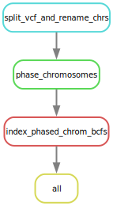
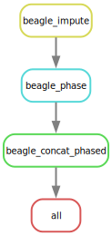

<!-- README.md is generated from README.Rmd. Please edit that file -->

```{r, include = FALSE}
knitr::opts_chunk$set(
  collapse = TRUE,
  comment = "#>"
)
```

<!-- badges: start -->
<!-- badges: end -->

The goal of **mega-impute-and-phase-snakeflows** is to provide a simple snakemake workflow
for phasing whole genome sequencing data, parallelized over chromosomes.  It is product
of the **M**olecular **E**cology and **G**enetic **A**nalysis Team at the Southwest
Fisheries Science Center's Santa Cruz Lab.  

The basic input is a VCF file and a text file with a list of chromosomes or regions
to be done. 

Currently, there are two methods implemented:  `eagle`, which is suitable for higher
read depth data with reliable genotype calls, and `beagle`, which is suitable
for lower coverage data with genotype likelihoods (but unreliable genotype calls) in the VCF.
Note that `beagle` does not accept BCF files.  It has be to be a .VCF.gz file, and it should
be indexed.


## BEAGLE

The easiest way to see how to configure the workflow for `beagle` is to see the small
test config in `.test/config-test-beagle` that uses the data in
`.test/data/small.vcf.gz`.  The comments in `.test/config-test-beagle/config.yaml`
contain all you need to know to set up the run.  You should copy the config file and
use it as a template for setting up your own run.
```yaml
`r paste(readLines(".test/config-test-beagle/config.yaml"), collapse = "\n")`
```

Basically, you just need an indexed vcf.gz file, an appropriate config file, and
a file of regions that is a single column, and will look like this, for example:
```
omy01
omy03
omy04
omy05
omy06
omy07
omy08
```
where those are chromosome names.

The steps done with the beagle workflow are:

1. Impute the genotypes using Beagle 4.1 for each chromosome.
2. Phase the output from the previous step.
3. Catenate the results VCFs back together.


## EAGLE

For using eagle, study, copy and modify the config file at `.test/config-test-eagle/config.yaml`
that looks like this:
```yaml
`r paste(readLines(".test/config-test-eagle/config.yaml"), collapse = "\n")`
```
The basic idea is that you give it:

1. The path to a vcf.gz or bcf file (it must have an index, .tbi or .csi)
with all the genotypes,
2. a white-space delimited file with no column names where the first column holds the
chromosome names (corresponding to what you have in the VCF file)
and the second holds the integer equivalent, for the chromosomes
that you want to phase.  For example if we wanted to do the first
7 chromosomes of _O. mykiss_ that file would look like:
```
omy01 1
omy02 2
omy03 3
omy04 4
omy05 5
omy06 6
omy07 7
```
I think this is necessary for `eagle` because it needs integer chromosome names.


The steps that the workflow does in `eagle` mode are:

1. Break the VCF file up into a bunch of smaller BCF files, one per chromosome that you
want to phase, and the chromosomes in each to use simple integers. Then index each of
those.  These go into the `resources/rcBCF` directory.
2. Launch a separate job to phase each chromosome, by default using 20 threads.
3. In the end, the phased BCF file for each chromosome gets indexed by bcftools.


## Command line invocation

**To dry-run the eagle test case**

```sh
 snakemake -np --configfile .test/config-test-eagle/config.yaml
```

**To dry-run the eagle test case**

```sh
 snakemake -np --configfile .test/config-test-beagle/config.yaml
```

**To run the eagle test case on a node with 20 cores**
```sh
 snakemake -p --cores 20 --set-threads phase_chromosomes=2 --use-conda  --configfile .test/config-test-eagle/config.yaml
```
Note that the `--set-threads phase_chromosomes=2` is there because each of the jobs
is quite small.  

Also note that the `.test/config-test-eagle/mykiss_chroms.tsv` file omits chromosomes
2 and 13 because, in this small version of the dataset, those chromosomes cause
eagle (and beagle) to throw errors.

### Running Under SLURM

A SLURM profile is included.  See `hpcc-profiles/slurm/sedna/config.v8+.yaml` for
snakemake 8+ and `hpcc-profiles/slurm/sedna/config.yaml` for Snakemake <= 7.

You will need to set resources as appropriate.  Setting threads of the beagle rules
can be done easily in the profile:
```yaml
set-threads:
  beagle_impute: 5
  beagle_phase: 5
```
For Beagle, be sure to set the Java heap as appropriate for the number of threads in the
run configfile itself. i.e.,:
```yaml
beagle_impute_mem: "–Xmx20g"
beagle_phase_mem: "–Xmx20g"

```

## Rule Graphs

Here is the rulegraph for this simple workflow, made with the commands:
```sh
snakemake --rulegraph --configfile .test/config-test-eagle/config.yaml | dot -Tsvg > figs/rulegraph-eagle.svg
snakemake --rulegraph --configfile .test/config-test-beagle/config.yaml | dot -Tsvg > figs/rulegraph-beagle.svg
```

### Eagle rulegraph

```{r, echo = FALSE, fig.align='center', out.width="25%"}

```

### Beagle rulegraph

```{r, echo = FALSE, fig.align='center', out.width="25%"}

```
