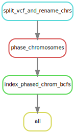

mega-impute-and-phase-snakeflows
================

- [Configuration](#configuration)
- [Output files](#output-files)
- [Command line invocation](#command-line-invocation)
- [Rule Graph](#rule-graph)

This is just a little workflow I put together for phasing genotypes in
an indexed VCF file using `eagle` (and eventually I will add BEAGLE 4 in
here for low coverage data, using genotype likelihoods).

The basic idea is that you give it:

1.  The path to a vcf.gz or bcf file (it must have an index, .tbi or
    .csi) with all the genotypes,
2.  a white-space delimited file where the first column holds the
    chromosome names (corresponding to what you have in the VCF file)
    and the second holds the integer equivalent, for the chromosomes
    that you want to phase. For example if we wanted to do the first 7
    chromosomes of *O. mykiss* that file would look like:

<!-- -->

    omy01 1
    omy02 2
    omy03 3
    omy04 4
    omy05 5
    omy06 6
    omy07 7

I think this is necessary for `eagle` because it needs integer
chromosome names.

The steps that the workflow does in `eagle` mode are:

1.  Break the VCF file up into a bunch of smaller BCF files, one per
    chromosome that you want to phase, and the chromosomes in each to
    use simple integers. Then index each of those. These go into the
    `resources/rcBCF` directory.
2.  Launch a separate job to phase each chromosome, by default using 20
    threads.
3.  In the end, the phased BCF file for each chromosome gets indexed by
    bcftools.

## Configuration

Currently, you can set what you need to set up if you are going to be
using this with `eagle` in the `.test/config-test-eagle/config.yaml`
file. That looks like this:

``` yaml
# path to the Eagle executable. (Only runs on Linux)
eagle_path: bin/eagle-Linux

# path to the two columns TSV file (with no column names). The first
# column is the chromosome name as it appears in the input VCF/BCF
# file and the second is the integer equivalent
chrom_file: .test/config-test-eagle/mykiss_chroms.tsv


# path to the VCF file of all the genotypes you want phased.
# This must be indexed (i.e. with bcftools).
vcf_input: ".test/data/small.vcf.gz"
# This is a path with a tiny data set for playing around.
#vcf_input: "tiny_data/small.vcf.gz"

# A map file that specifies 1 centiMorgan per megabase on all chromosomes.
# This is used if a good recombination map is not available for your
# species. Used by eagle
map_input: "config/genetic_map_1cMperMb.txt"
```

## Output files

The phased BCF files and their indexes are produced with names/paths
like:

    results/phased_bcf/chr-1.bcf
    results/phased_bcf/chr-1.bcf.csi
    results/phased_bcf/chr-2.bcf
    results/phased_bcf/chr-2.bcf.csi
    results/phased_bcf/chr-3.bcf
    results/phased_bcf/chr-3.bcf.csi
    ...

Like a standard snakemake workflow, the log files appear in
`results/log/rule-name` where `rule-name` is the name of the rule that
created the log files.

## Command line invocation

**For a dry-run**

``` sh
snakemake -np
```

**For running it on a node with 20 cores**

``` sh
snakemake --cores 20 --use-conda -p
```

Note that the phasing is done, by default with 20 threads per
job/chromosome. If you need to change that, edit the Snakefile.

**For running it across multiple SLURM nodes each with 20 cores and 94Gb
of RAM**

    snakemake --jobs 100  -p --use-conda --profile sedna_slurm_profile/

That took about an hour on a day when SEDNA was not overutilized.

## Rule Graph

Here is the rulegraph for this simple workflow, made with the command:

``` sh
snakemake --rulegraph | dot -Tsvg > figs/rulegraph.svg
```


